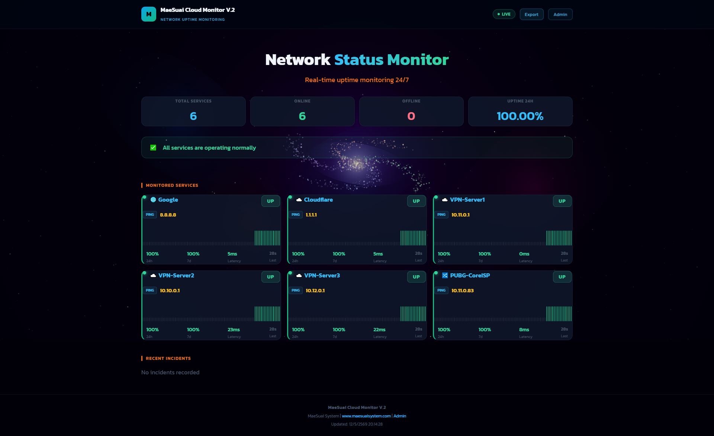
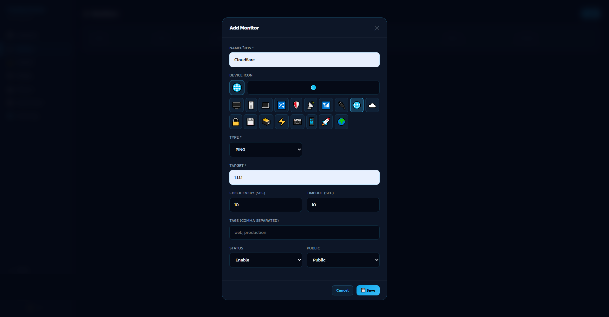
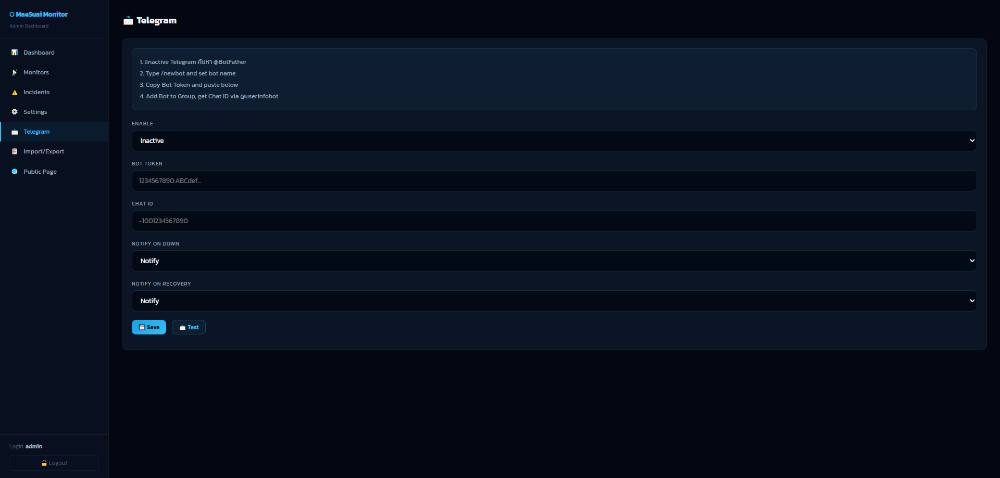
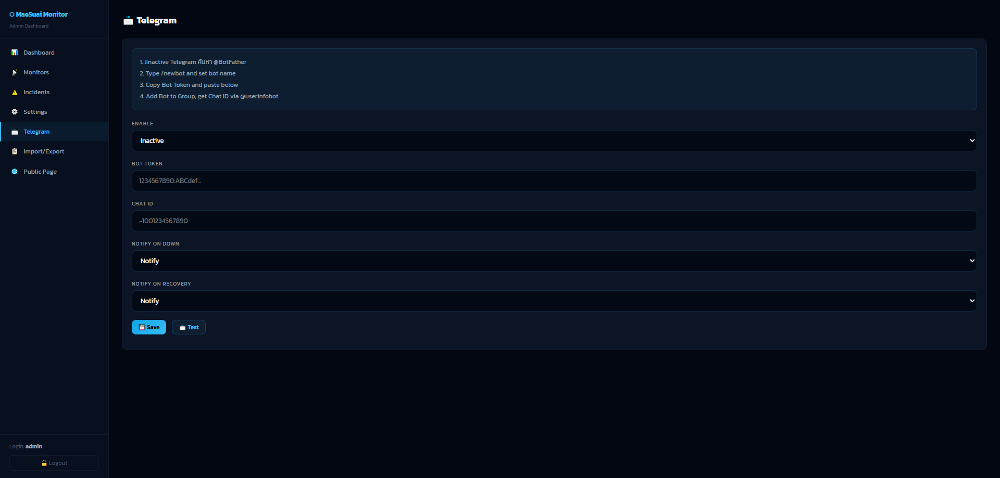

# MaeSuai Cloud Monitor

Network uptime monitoring system built with Node.js + SQLite + Socket.IO



## Features
- HTTP / HTTPS / PING / TCP monitoring
- Real-time dashboard with WebSocket
- Telegram notifications
- Import / Export monitors
- Incident tracking
- Galaxy animated background

---

## Screenshots

### Public Status Page


### Add Monitor


### Telegram Notifications


### Telegram Settings


### Import / Export


---

## Installation Method 1 — Standard (Ubuntu/Debian)

```bash
apt-get install -y git curl
git clone https://github.com/maxspeedcom/MaeSuai-Monitor.git
cd MaeSuai-Monitor
chmod +x install.sh
bash install.sh
```

---

## Installation Method 2 — Docker

### Install Docker
```bash
curl -fsSL https://get.docker.com | sh
```

### Run
```bash
git clone https://github.com/maxspeedcom/MaeSuai-Monitor.git
cd MaeSuai-Monitor
docker compose up -d --build
```

### Docker commands
```bash
docker compose logs -f    # View logs
docker compose down       # Stop
docker compose restart    # Restart
git pull && docker compose up -d --build  # Update
```

---

## Access
| URL | Description |
|-----|-------------|
| `http://YOUR_IP:3000` | Public Status Page |
| `http://YOUR_IP:3000/admin` | Admin Dashboard |

## Default Login
- **Username:** admin
- **Password:** admin1234

> ⚠️ Please change password after first login

---

## Requirements
| | Standard | Docker |
|--|---------|--------|
| OS | Ubuntu 20.04+ / Debian 11+ | Any |
| Runtime | Node.js 20+ | Docker 20+ |
| RAM | 512MB+ | 512MB+ |
| Disk | 1GB+ | 1GB+ |
